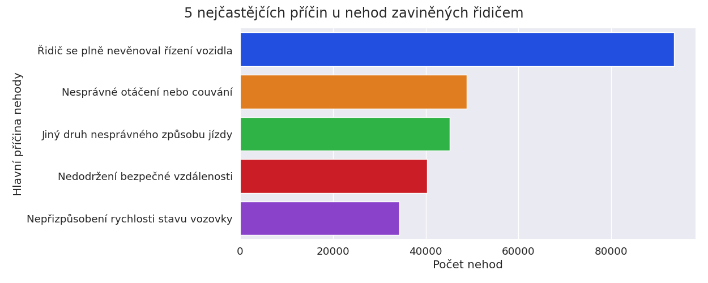

# 5 nejčastějších příčin nehod v ČR zaviněných řidičem
Na grafu vizalizujícím nejčastější příčiny nehod můžeme vidět, že nejčastější příčinou nehody, která byla způsobena řidičem, je nevěnování se řízení. Touto příčinou bylo zaviněno 20% všech nehod, což je skoro 2x více, než 2. nejčastější příčina - nesprávné otáčení nebo couvání. To bylo příčinou v 10.4% nehodách v ČR.

# Nejčastější příčiny nehod, které byly zaviněny řidičem, v jednotlivých krajích
V následující tabulce můžeme vidět, že ve většině krajů je nejčastější příčinou v nehodách zaviněných řidičem nevěnování se řízení, ovšem není tomu tak ve všech krajích. Například v Libereckém kraji je nejčastější příčinou nezvládnutí řízení. Největší část nehod způsobena nevěnováním se řízení byla způsobena v Jihomoravském kraji - 43.3%

| Kraj   | Příčina nehody                         |   Počet nehod |   Procento nehod s touto příčinou v daném kraji |
|:-------|:---------------------------------------|--------------:|------------------------------------------------:|
| PHA    | Jiný druh nesprávného způsobu jízdy    |         22123 |                                            19.5 |
| ULK    | Řidič se plně nevěnoval řízení vozidla |         15515 |                                            31.3 |
| JHM    | Řidič se plně nevěnoval řízení vozidla |         14216 |                                            43.3 |
| STC    | Řidič se plně nevěnoval řízení vozidla |         13781 |                                            21.6 |
| ZLK    | Řidič se plně nevěnoval řízení vozidla |          7029 |                                            41.5 |
| MSK    | Nesprávné otáčení nebo couvání         |          6431 |                                            15.3 |
| JHC    | Řidič se plně nevěnoval řízení vozidla |          5215 |                                            23.6 |
| PAK    | Řidič se plně nevěnoval řízení vozidla |          4914 |                                            27.4 |
| KVK    | Řidič se plně nevěnoval řízení vozidla |          3824 |                                            31.1 |
| OLK    | Nesprávné otáčení nebo couvání         |          3285 |                                            15.1 |
| HKK    | Řidič se plně nevěnoval řízení vozidla |          3280 |                                            15.3 |
| PLK    | Nesprávné otáčení nebo couvání         |          3134 |                                            17.2 |
| LBK    | Nezvládnutí řízení vozidla             |          2993 |                                            15.8 |
| VYS    | Řidič se plně nevěnoval řízení vozidla |          2741 |                                            17.1 |

Rozdílené jsou také příčiny nehod způsobených řidiči v a mimo obec. Zatímco v obci je nejčastější příčinou nehody nevěnování se řízení představující 21% nehod v obci, mimo obec je nejčastější příčinou nepřizpůsobení rychlosti stavu vozovky. Tato příčina způsobuje 17.3% nehod mimo obec
